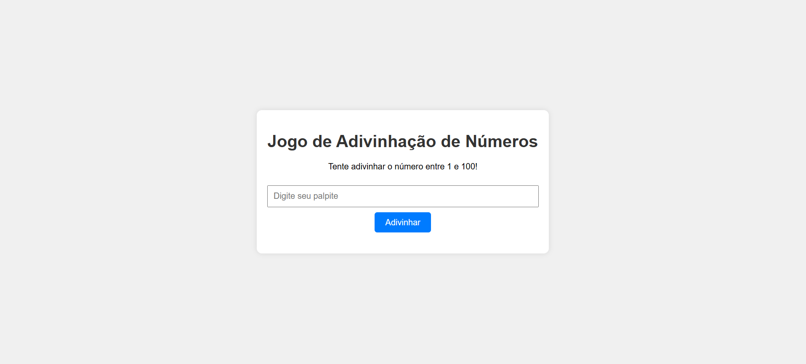

# 🎯 Number Guessing Game

A simple number guessing game built with **HTML, CSS, and JavaScript**. The player must try to guess a randomly generated number between **1 and 100**.

## 🎮 How It Works

The game generates a random number between **1 and 100**.

The player enters a guess and clicks the **"Guess"** button.

After each attempt, the game provides feedback:

- 🔼 The guessed number is higher than the secret number.
- 🔽 The guessed number is lower than the secret number.
- 🎉 The player guessed the correct number.

## 🖥️ Preview



## 🚀 Technologies

- HTML5
- CSS3
- JavaScript

## 📂 Project Structure

```text
jogo/
│
├── index.html
├── styles.css
├── script.js
└── README.md
